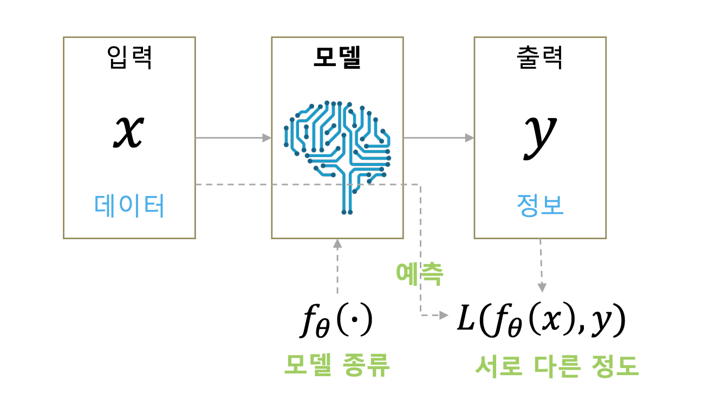

# 오토인코딩 강의 정리
DIP 현장실습 도중 오토인코딩을 도로 아스팔트 손상을 구별하는데 활용하기 위해 학습함

### 오토인코더 구조도

## 기본적인 키워드
- Unsupervised learning
- Manifold learning, Nonlinear Dimensional reduction
- Generative model learning
- ML(Maximul likelyhood) density estimate

## 1. 딥러닝 기본 정리
모두가 딥러닝을 활용하지만 정확히 기본 개념을 모름. 이번 기회에 정리를 해보자.

딥뉴럴네트워크를 할때 ML estimate를 하는거다라는걸 이해하면 성공

### 전통적인 머신 러닝 접근 방식

- 데이터에서 정보를 얻을려고 함 -> 데이터를 모음
- 모델을 정함. 모델 => f
- 모델을 결정짓는 파라미터를 추정해야됨 <= 학습
- 파라미터에 대해 입략값의 출력값이 실제추출되야하는 데이터와 다른정도 => loss function : 이것도 정하고 감.
- 모델을 결정짓는 파라미터를 변화시키면서 로스를 가장 최소로 만듬 (학습)
- 입력값이 고정되면 고정된 출력값이 나옴

### 그래서 고전적 해석으로 딥러닝 어떻게 해석?
- 모델을 딥뉴럴넷으로 정함. 네트워크 구조 정의 등등
- loss function 정의해야됨. 현제 딥러닝은 MSE, cross entropy  아무거나 못 쓰기 때문에(back propagation 알고리즘을 통해서 학습을 하기 때문에 제약 조건이 생김)
- back propagation 알고리즘 loss function에 대한 가정 2개가 필요 1. 전체 로스는 각 로스의 합 2. 로스는 출력값만 가지고 구한다.

gradient Descent 방법에서의 파라미터 변경법은 아래와 같음

그 뒤에는 전체에 대한 gradient를 구해야되는데 너무 양이 많아서 배치 한개의 평균을 구해서 구함. 

한번 평균 구하는것 = 스탭

전체 다한거 = epoch

원래 각 레이어별 많은 파라미터의 로스 함수를 미분해서 구했었는데 그 연산량이 많아서 back propagation 알고리즘 나오기 전에 암흑기 였음

### - backpropagation 관점
MSE :액티베이션 함수 미분값이 0에 가까우면 웨이트와 바이어스 업데이트가 더디다. grandient vanishing problem 그럼 미분값이 이쁘게 들어가게 하면됨 -> relu

cross entropy: 액티베이션 함수 미분값이 공교롭게 필요없다. 그래서 미분값에 무관하게 된다. 학습에 강인함

이관점에서는 cross entropy가 더 좋은듯함. 물론 항상은 아님

### - ML 관점
이 관점에서는 네트워크 출력값에 대한 해석이 중요함

네트워크 출력값이 y가 나올 확률이 최대가 되게하고싶다.
그래서 그 확률들의 분포도 정하고간다.

네트워크 출력은 확률 분포를 정의하는 파라미터를 추정하는것
-> 평균이랑 표준 편차를 추정하는것

로스 함수는 -log(p(y|f(x)))

세타를 찾는다 = 확률 분포를 찾음

그래서 샘플링이 가능함 -> 비슷한 것도 가능해짐 ex) 개, 고양이 종유 출력.

#### 계산 해보니까
가우시안 분포 => mse

베르누이 분포 => cross entropy

ML에서는 분포를 추정하는것이 아닌 분포는 정해두고 분포의 파라미터를 추정하는것이다.

## 2. Manifold learning

### - Manifold 가 무엇인가?
고차원 데이터를 공간에 나타내면 그 데이터들을 잘 가지는 서브 스페이스(manifold)

### - 어디에 써먹냐?
- 데이터 압축
- 고차원은 시각화 불가 저차원으로 줄여서 시각화 하려고
- 차원의 저주 해결
- 가장 중요한 특징 찾기

### 데이터 압축
오토 인코더를 압축에 이용하니까 jpeg보다 좋더라

### 시각화
http://vision-explorer.reactive.ai/#/?_k=aodf68

시각화 대장

### 차원의 저주
차원이 커질수록 -> 부피 증가 -> 만약 데이터량 동일함 -> 그러면 밀도 감소 -> 같은 밀도를 유지 시키려면 데이터량이 매우 많이 필요해짐

그래서 이들을 포함하는 매니폴드를 찾을수 있을 것 같다.
그것을 벗어나면 데이터 밀도도 감소

같은 종류는 비슷하게 몰려있을것같다. -> 매니폴드 잘찾는다 = 관계성 잘찾을것같다. 

### 특징 추출
압축을 잘했다면 특징을 잘찾은것같음

중간 사진을 찾을때 그냥 중간점 보다는 매니폴드에서의 중간이면 의미 있을듯하다.

매니폴드도 disentangle 해야 특징별로 된거임

### 오토인코더가 기존의 차원 축소랑 뭐가 다름?

#### - PCA (선형적)
원데이터를 공간에 뿌려서 선형적인 공간 추출

선형적이라서 꼬여있는 경우는 잘 못함 entangled 되있다.

#### - ISO, LLE 
가까운 친구들 먼저 찾음 -> 가까우면 비슷할꺼야!!라는 생각으로

## 3. 오토인코더
입력 - 차원 축소 - 출력

출력과 입력은 같은 구조
